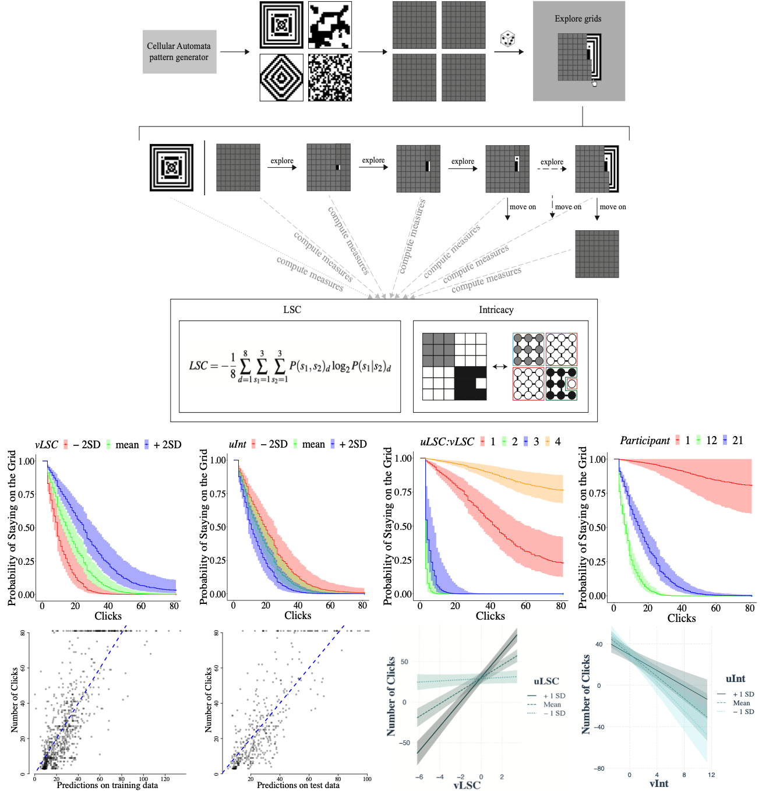

# Aesthetics Curiosity as Complexity-based Exploration

[](https://www.python.org)
[](https://jupyterlab.readthedocs.io/en/stable)
[](https://cran.r-project.org)
[](https://www.rstudio.com)

This repository contains the data and scripts for the paper Linking Aesthetics and Curiosity using Complexity submitted to [Scientific Reports Collection on Neuroaesthetics and Creativity](https://www.nature.com/collections/giidgedaec) 

Authors: [Surabhi S Nath](https://surabhisnath.github.io), [Franziska Brändle](https://www.kyb.tuebingen.mpg.de/person/104445/250676), [Eric Schulz](https://www.kyb.tuebingen.mpg.de/person/103915), [Peter Dayan](https://www.mpg.de/12309357/biologische-kybernetik-dayan)#, [Aenne Brielmann](https://www.kyb.tuebingen.mpg.de/person/58620/2549)# (# indicates equal contribution)

## Abstract

An important aesthetic decision we make is whether to continue engaging with a sensory object or to cast it aside and engage with a new one. We operationalize a form of this decision that pertains to aesthetic curiosity by providing participants a fixed duration of time to uncover a 2D black and white pixel pattern progressively, or instead to move onto a next pattern drawn from the same generative process. This presents a tradeoff between specific and diversive exploration, i.e. exploration of specific objects versus exploration of the distribution of all objects. We show that quantitative measures of the
complexity of the partial patterns that participants are immediately
viewing, and  of the full pattern (that they might not ultimately see),
together predict both the immediate probability of their moving on from a pattern, and the amount that it is explored. We interpret this finding in the light of our previous work relating similar measures of complexity to beauty. We discuss the potential of complexity, and aesthetic value more generally, to pave the way for further research on aesthetic decisions for example decisions pertaining to beauty, curiosity, and ultimately also creativity.

A demo video of the task is provided [here](https://drive.google.com/file/d/1_AMR0RhatSbPrcMZcLu1wcWOLTfgSY2t/view?usp=sharing).



## Respository Description

The repository contains the following folders:
- **data**: contains the processed .csv data files for the extended-complexity and grid-search experiments. In the extended-complexity folder, each data file has 6 columns indicating the pattern number, visible complexity reponse (0-100), imagined complexity response (0-100), reaction time (ms), is_repeated flag which indicates if the pattern is repeated (6 patterns were repeated for each participant) and trial number. The dictionary mapping pattern names to pattern numbers is provided in `scrips/complexity-extended/utils/pattern_stats.csv`. The data folder also has info.csv which stores participant details such as demographics, open-ended reponses, number of attention checks presented/failed and total time taken. In the grid-earch folder, each data file is a raw .json file storing all behaviour data (on all grids visited and all clicks made per grid) from the experiment. The data is processed at grid and click level and provided in `scrips/grid-search/utils/grid_data.csv` and `scrips/grid-search/utils/click_data.csv`
- **figures**: contains all the figures in the main paper.
- **generator**: `generator/cellular_automata.py` is the stimuli generation script. Generates 2 folders `generator/stimuli/` containing all stimuli and `generator/gifs/` containing stimuli evolutions saved as .gif files.
- **measures**: this folder contains implementations of the 2 pattern quantification measures (LSC and intricacy) borrowed from Nath et al., 2023. 
- **patterns**: contains all the patterns used in the extended-complexity and grid-search experiments. `complexity-extended/instructions` and `grid-search/instructions` folders contains the patterns used in the task descriptions, `complexity-extended/attentioncheck` folder consists of the patterns which were used as attention check in the extended-complexity experiment. `complexity-extended/experiment` folder consists of 4 sets each with 54 patterns used in the extended-complexity experiment. `grid-search/experiment` folder consists of 14 ranges of stimuli used in the grid-search experiment, each spanning a range of complexities (as per the metric).

- **scripts/complexity-extended**: contains analysis scripts for the extended-complexity experiment. `MixedEffectsModelling.R` contains the modelling analyses for the extended-complexity experiment. Plots and model fits are stored in `plots` and `model_fits` respectively.

- **scripts/grid-search**: contains analysis scripts for the grid-search experiments. `DescriptiveAnalysis.ipynb` presents the descriptive analyses and `MixedEffectsModelling.R`, `SurvivalAnalysis.R` contain the mixed effects regression and survival analysis modelling respectively. Plots and model fits are stored in `plots` and `model_fits` respectively.

## Setup

We recommend setting up a python virtual environment and installing all the requirements. Please follow these steps:

```bash
git clone 

python3 -m venv .env

# On macOS/Linux
source .env/bin/activate
# On Windows
.env\Scripts\activate

pip install -r requirements.txt
```

## Running the code


## Citation

If you found this work useful, please consider citing us:


## Contact

Please feel free to email us at surabhi.nath@tuebingen.mpg.de
